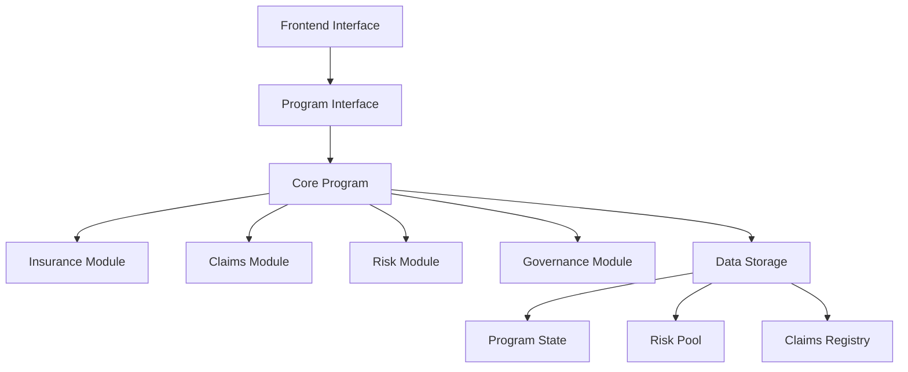

# FreelanceShield Technical Architecture

## Overview
FreelanceShield is a revolutionary decentralized insurance protocol built on Solana using the Anchor framework. Designed specifically for the freelance economy, it provides robust risk management, transparent claims processing, and community-driven governance.

## Core Principles
1. **Decentralization**: Fully on-chain operations with no single point of failure
2. **Transparency**: All operations and decisions are verifiable on the blockchain
3. **Efficiency**: Leveraging Solana's high throughput and low fees
4. **Security**: Comprehensive smart contract protections and risk management
5. **Community Governance**: Decentralized decision-making through token voting

## System Architecture

### High-Level Component Diagram


## Detailed Component Breakdown

### 1. Core Program (`freelance_shield_core`)
- **Program ID**: `FSCoreXXXXXXXXXXXXXXXXXXXXXXXXXXXXXXXXXXXXXXXX`
- **Main Responsibilities**:
  - Program initialization and configuration
  - Authority management
  - Cross-module coordination
  - Emergency controls

### 2. Insurance Management Module
#### Key Features
- Product lifecycle management
  - Creation, activation, deactivation
  - Parameter updates
- Policy management
  - Purchase, renewal, cancellation
  - Coverage adjustments
- Premium calculations
  - Dynamic pricing based on risk factors
  - Discounts for long-term policies

#### Data Structures
```rust
pub struct InsuranceProduct {
    pub id: u64,
    pub name: String,
    pub description: String,
    pub coverage_type: CoverageType,
    pub base_premium_rate: u16,
    pub risk_multiplier: u16,
    pub max_coverage_amount: u64,
    pub min_coverage_period: u16,
    pub is_active: bool,
    pub created_at: i64,
    pub updated_at: i64,
}

pub struct InsurancePolicy {
    pub id: u64,
    pub product_id: u64,
    pub owner: Pubkey,
    pub coverage_amount: u64,
    pub premium_amount: u64,
    pub start_date: i64,
    pub end_date: i64,
    pub status: PolicyStatus,
    pub claims_count: u8,
    pub total_claims_paid: u64,
}
```

### 3. Claims Processing Module
#### Workflow Details
1. **Claim Submission**
   - Policy validation
   - Evidence collection (IPFS integration)
   - Initial assessment

2. **Community Voting**
   - Token-weighted voting system
   - Time-bound decision period
   - Incentivized participation

3. **Arbitration**
   - Expert panel selection
   - Evidence review
   - Final decision binding

4. **Payment Processing**
   - Automated payout calculations
   - Multi-sig wallet security
   - Payment tracking

#### Data Structures
```rust
pub struct InsuranceClaim {
    pub id: u64,
    pub policy_id: u64,
    pub claimant: Pubkey,
    pub amount: u64,
    pub description: String,
    pub evidence_hashes: Vec<String>,
    pub status: ClaimStatus,
    pub votes_for: u64,
    pub votes_against: u64,
    pub created_at: i64,
    pub updated_at: i64,
}

pub struct ClaimVote {
    pub claim_id: u64,
    pub voter: Pubkey,
    pub vote: bool, // true = approve, false = reject
    pub vote_weight: u64,
    pub timestamp: i64,
}
```

### 4. Risk Management Module
#### Key Features
- Risk pool management
  - Capital allocation
  - Reserve requirements
- Risk simulations
  - Monte Carlo simulations
  - Stress testing
- Premium adjustments
  - Dynamic pricing models
  - Market volatility factors

#### Data Structures
```rust
pub struct RiskPool {
    pub total_capital: u64,
    pub total_coverage_liability: u64,
    pub total_premiums_collected: u64,
    pub total_claims_paid: u64,
    pub current_reserve_ratio: u8,
    pub premium_to_claims_ratio: u16,
    pub last_metrics_update: i64,
    pub bump: u8,
}

pub struct RiskSimulation {
    pub id: u64,
    pub timestamp: i64,
    pub base_capital: u64,
    pub simulated_capital: u64,
    pub worst_case_loss: u64,
    pub probability_of_ruin: f32,
    pub recommended_premium_adjustment: i8,
}
```

### 5. Governance Module
#### Features
- Program parameter updates
- Risk buffer management
- Emergency controls
- Community proposals
- Voting mechanisms

#### Data Structures
```rust
pub struct GovernanceProposal {
    pub id: u64,
    pub proposer: Pubkey,
    pub description: String,
    pub voting_start: i64,
    pub voting_end: i64,
    pub votes_for: u64,
    pub votes_against: u64,
    pub status: ProposalStatus,
    pub executed: bool,
}

pub struct GovernanceVote {
    pub proposal_id: u64,
    pub voter: Pubkey,
    pub vote: bool, // true = approve, false = reject
    pub vote_weight: u64,
    pub timestamp: i64,
}
```

## Security Architecture

### Key Security Features
1. **Smart Contract Security**
   - Comprehensive input validation
   - Proper PDA usage
   - Authority checks
   - Reentrancy protection

2. **Financial Security**
   - Risk buffer implementation
   - Capital adequacy monitoring
   - Reserve requirements
   - Stress testing

3. **Operational Security**
   - Multi-sig wallets
   - Emergency pause functionality
   - Governance-controlled upgrades

### Security Best Practices
- Regular security audits
- Bug bounty program
- Continuous monitoring
- Incident response plan

## Performance Optimization

### Solana-Specific Optimizations
- Efficient PDA usage
- Minimal account updates
- Batch processing
- Parallel transaction execution

### Data Management
- Compact data structures
- Efficient indexing
- On-chain/off-chain data separation
- State compression techniques

## Integration Ecosystem

### Frontend Integration
- Web3.js/Anchor.js integration
- Wallet connection
- Transaction handling
- Event listening

### External Services
- Price oracles
- Risk data providers
- IPFS for evidence storage
- Analytics dashboards

## Future Roadmap
1. **Short-term**
   - Enhanced risk models
   - Improved governance features
   - Mobile app integration

2. **Medium-term**
   - Cross-chain compatibility
   - Advanced fraud detection
   - Machine learning integration

3. **Long-term**
   - Autonomous risk management
   - Decentralized identity integration
   - AI-powered claims assessment

## Conclusion
FreelanceShield represents a paradigm shift in decentralized insurance, combining cutting-edge blockchain technology with robust risk management and community governance. Its architecture is designed to be scalable, secure, and adaptable to the evolving needs of the freelance economy.
